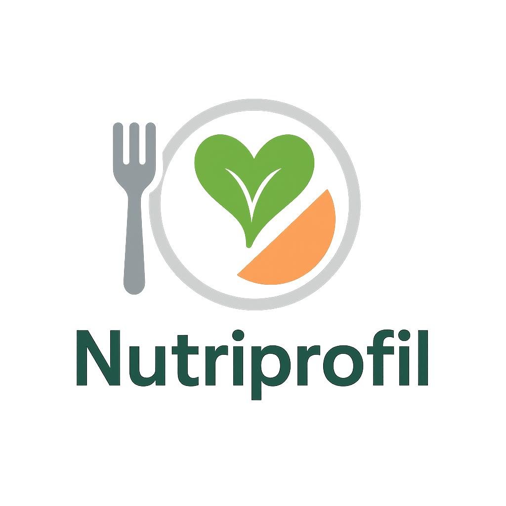

  

**Nutriprofil** est une application d’analyse et de recommandation alimentaire conçue pour mieux comprendre les habitudes nutritionnelles des Français, évaluer les risques sanitaires associés à certains types de consommation, et proposer des recommandations alimentaires personnalisées.

----

## 🚀 Objectifs du projet

L'application **Nutriprofil** repose sur trois volets complémentaires :

### 1. 📊 Analyse de la consommation alimentaire en France
Ce module fournit une vision d’ensemble des habitudes alimentaires des Français :
- Répartition de la consommation par catégories (produits transformés, fruits et légumes, boissons sucrées, etc.)
- Évolution des tendances alimentaires au fil des années
- Données par région, âge, sexe, etc.

### 2. ⚠️ Évaluation des risques pour la santé
Ce volet établit le lien entre les habitudes alimentaires et les principaux risques pour la santé :
- Détection des excès : trop gras, trop sucré, trop salé
- Mise en évidence des maladies associées : diabète de type 2, maladies cardiovasculaires, obésité, hypertension, etc.
- Visualisation des corrélations entre profils de consommation et risques pathologiques

### 3. 🧬 Recommandations personnalisées
Le cœur de Nutriprofil : des conseils adaptés à chaque utilisateur selon son profil et ses habitudes.
- Analyse des apports actuels à partir d’un journal alimentaire
- Comparaison avec les recommandations officielles (PNNS, OMS…)
- Suggestions de régimes alimentaires équilibrés (méditerranéen, flexitarien, DASH…)
- Objectifs personnalisés : perte de poids, amélioration cardio-métabolique, optimisation des performances sportives, etc.

---

## 🛠️ Technologies utilisées
- Python (Pandas, Scikit-learn, Streamlit/Flask pour l’interface)
- PostgreSQL (ou SQLite) pour la gestion des données
- API d'open data (INSEE, CIQUAL, Santé Publique France)
- Visualisation : Plotly, Seaborn, Matplotlib
- IA (optionnelle) : recommandations basées sur des modèles de machine learning

---

## 📂 Structure du projet (exemple)

En cours...
